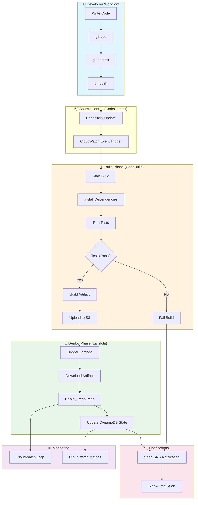
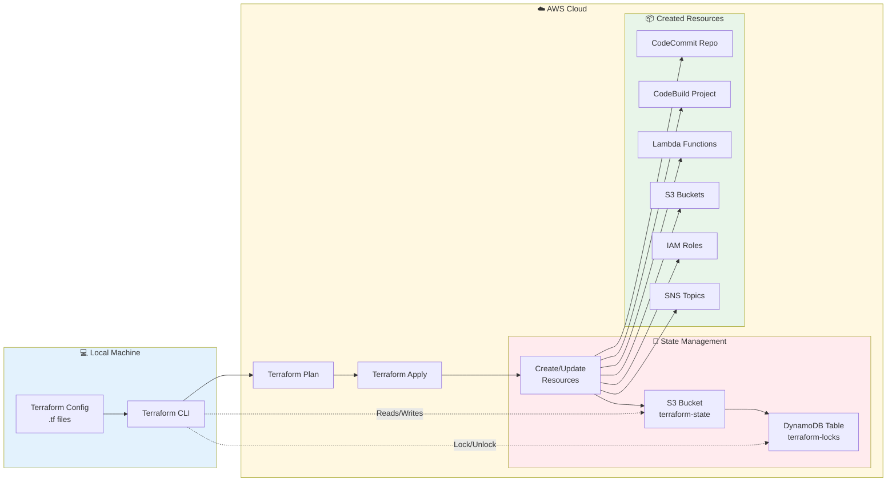
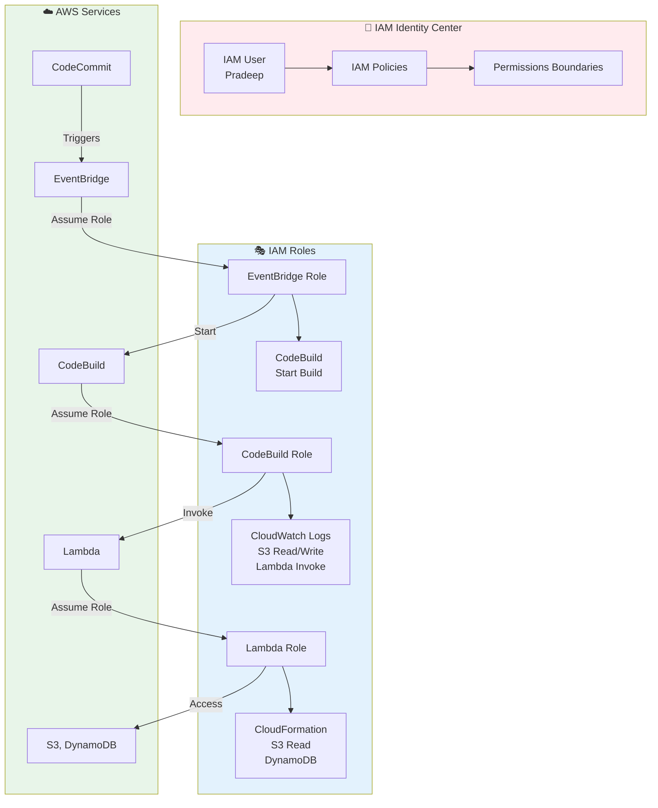
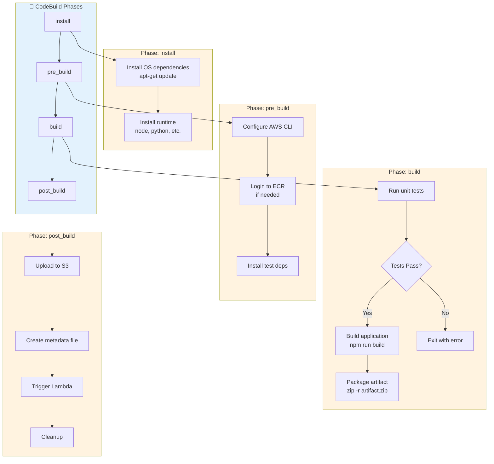
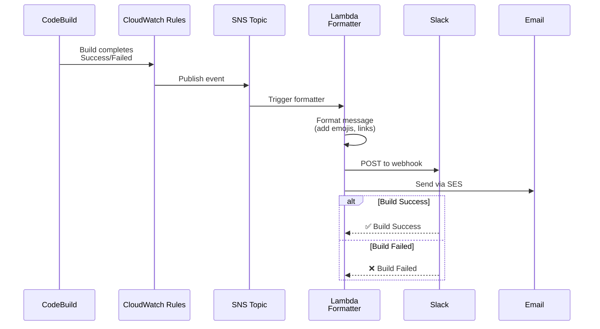
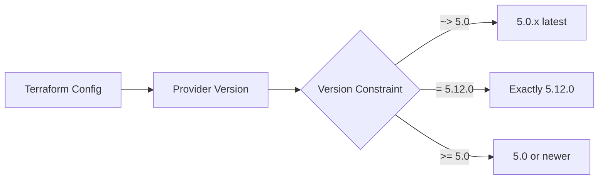
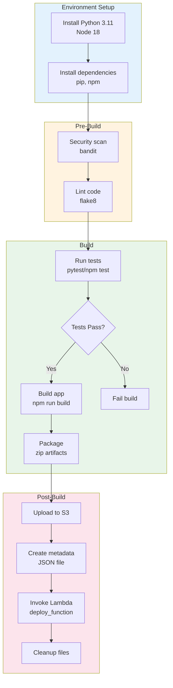
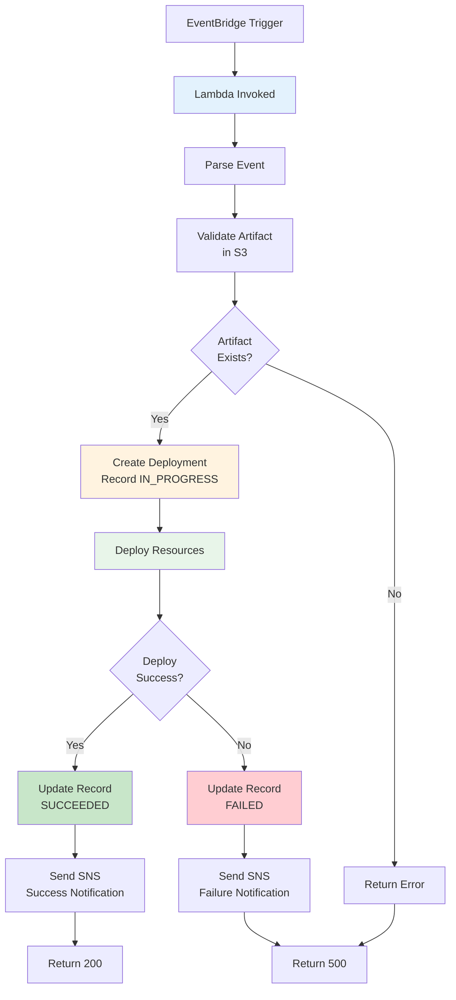
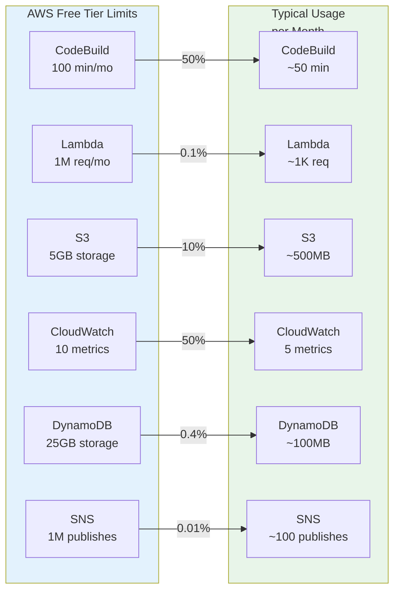
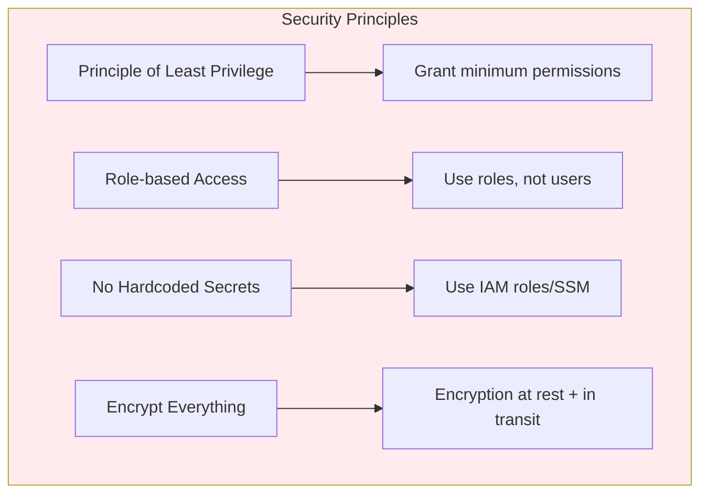

# Serverless DevOps Pipeline on AWS (Free Tier)

**Project:** Automated CI/CD with Infrastructure as Code  
**Cost:** $0/month (AWS Free Tier)  
**Author:** Preethi 🔬  
**Date:** March 25, 2026

---

## 📋 Table of Contents

1. [Executive Summary](#1-executive-summary)
2. [Architecture Overview](#2-architecture-overview)
3. [Tool Selection & Alternatives](#3-tool-selection--alternatives)
4. [Detailed Flow Diagrams](#4-detailed-flow-diagrams)
5. [Implementation Guide](#5-implementation-guide)
6. [All Scripts & Configurations](#6-all-scripts--configurations)
7. [Cost Analysis](#7-cost-analysis)
8. [Security Best Practices](#8-security-best-practices)
9. [Troubleshooting](#9-troubleshooting)

---

## 1. Executive Summary

### What We're Building
A complete **serverless DevOps pipeline** that automatically builds, tests, and deploys applications using only AWS Free Tier services. Zero server management, zero monthly costs.

### Why This Architecture?
| Benefit | Explanation |
|---------|-------------|
| **Zero Cost** | Uses only always-free AWS services |
| **Zero Maintenance** | No servers to patch, scale, or monitor |
| **Scalable** | Automatically handles 1 to 1,000,000 requests |
| **Secure** | IAM-controlled, no exposed credentials |
| **Portable** | Infrastructure as Code = deploy anywhere |

---

## 2. Architecture Overview

### High-Level Architecture

```
┌─────────────────────────────────────────────────────────────────────────────┐
│                              DEVOPS PIPELINE                                  │
├─────────────────────────────────────────────────────────────────────────────┤
│                                                                              │
│  ┌─────────────┐    ┌──────────────┐    ┌─────────────┐    ┌────────────┐  │
│  │  Developer  │───▶│   Git Push   │───▶│ CodeCommit  │───▶│ CodeBuild  │  │
│  │   (You)     │    │   (Git)      │    │   (Git)     │    │  (Build)   │  │
│  └─────────────┘    └──────────────┘    └─────────────┘    └─────┬──────┘  │
│                                                                    │        │
│  ┌─────────────┐    ┌──────────────┐    ┌─────────────┐          │        │
│  │   Slack/    │◀───│    SNS       │◀───│   Lambda    │◀─────────┘        │
│  │   Email     │    │ (Notify)     │    │  (Deploy)   │                   │
│  └─────────────┘    └──────────────┘    └─────────────┘                   │
│                                                │                            │
│  ┌─────────────┐    ┌──────────────┐          │                            │
│  │ CloudWatch  │◀───│   S3         │◀─────────┘                            │
│  │ (Monitor)   │    │  (Artifacts) │                                       │
│  └─────────────┘    └──────────────┘                                       │
│                                                                              │
└─────────────────────────────────────────────────────────────────────────────┘
```

### Component Breakdown

| Layer | Service | Purpose | Free Tier |
|-------|---------|---------|-----------|
| **Source Control** | AWS CodeCommit | Git repository hosting | 5 users, 50GB |
| **Build** | AWS CodeBuild | Compile, test, package | 100 min/month |
| **Compute** | AWS Lambda | Run deployment scripts | 1M requests/month |
| **Storage** | Amazon S3 | Store build artifacts | 5GB |
| **Database** | DynamoDB | Store deployment state | 25GB |
| **Monitoring** | CloudWatch | Logs and metrics | Basic tier |
| **Notifications** | Amazon SNS | Alerts and notifications | 1M requests/month |
| **Orchestration** | EventBridge | Trigger on Git events | Free tier |
| **Infrastructure** | Terraform | Provision all resources | Local tool (free) |

---

## 3. Tool Selection & Alternatives

### 3.1 Source Control: AWS CodeCommit

**Why CodeCommit?**
- ✅ Free for 5 users (GitHub costs $4/user/month)
- ✅ Integrated with AWS IAM (no separate auth)
- ✅ Triggers AWS services natively
- ✅ Private repos by default

**Alternatives Comparison:**

| Tool | Cost | Pros | Cons | When to Choose |
|------|------|------|------|----------------|
| **CodeCommit** | FREE | AWS native, IAM integration | Smaller ecosystem | **Free tier projects** |
| **GitHub** | $4/user/month | Largest ecosystem, Actions | Costs money, separate auth | Open source, teams |
| **GitLab** | $0-19/user | Built-in CI/CD, self-hosted option | Complex, resource-heavy | Self-hosted needs |
| **Bitbucket** | $0-15/user | Jira integration | Slower, smaller community | Atlassian shops |
| **Azure DevOps** | $6/user/month | Microsoft integration | Vendor lock-in | Azure-only shops |

**Decision Matrix:**
```
Cost Priority:     CodeCommit > GitLab (free tier) > GitHub > Azure DevOps
Feature Rich:      GitHub > GitLab > Azure DevOps > Bitbucket > CodeCommit
AWS Integration:   CodeCommit > GitLab > GitHub > Azure DevOps
```

---

### 3.2 Build Service: AWS CodeBuild

**Why CodeBuild?**
- ✅ 100 build minutes/month free
- ✅ No build servers to manage
- ✅ Native Docker support
- ✅ Caching support for faster builds

**Alternatives Comparison:**

| Tool | Cost | Pros | Cons | When to Choose |
|------|------|------|------|----------------|
| **CodeBuild** | FREE (100 min) | Serverless, AWS native | 250MB memory limit free tier | **AWS projects** |
| **GitHub Actions** | $0-0.008/min | Huge marketplace, easy YAML | Costs after 2,000 minutes | GitHub repos |
| **GitLab CI** | $0 (self-hosted) | Integrated, Kubernetes native | Need runners | Self-hosted GitLab |
| **Jenkins** | $0 (self-hosted) | Infinite plugins, mature | High maintenance, security risk | Enterprise control |
| **Travis CI** | $0-69/month | Simple config | Pricing changes, less popular | Simple projects |
| **CircleCI** | $0-15/month | Fast, Docker native | Credit-based pricing confusing | Docker-heavy projects |

**Build Minute Comparison (per month):**
```
CodeBuild:      100 min free, then $0.005/min
GitHub Actions: 2,000 min free, then $0.008/min
Travis CI:      10,000 credits free (~1,000 min)
CircleCI:       2,500 credits free (~250 min)
```

---

### 3.3 Infrastructure as Code: Terraform

**Why Terraform?**
- ✅ Cloud-agnostic (works with AWS, Azure, GCP)
- ✅ State management tracks all changes
- ✅ Massive provider ecosystem
- ✅ Free and open source

**Alternatives Comparison:**

| Tool | Type | Pros | Cons | When to Choose |
|------|------|------|------|----------------|
| **Terraform** | Declarative | Multi-cloud, mature, free | State file complexity | **Multi-cloud, teams** |
| **AWS CloudFormation** | Declarative | Native AWS, free | AWS-only, verbose YAML | AWS-only shops |
| **Pulumi** | Imperative | Real programming languages | Newer, smaller community | Developers who code IaC |
| **Ansible** | Imperative | Simple, agentless | Not true IaC, config drift | Configuration management |
| **CDK** | Imperative | AWS native, TypeScript/Python | AWS-only, abstraction leaks | AWS developers |
| **Crossplane** | Declarative | Kubernetes-native IaC | Complex, requires K8s | Kubernetes shops |

**Language Comparison:**
```
Terraform:      HCL (HashiCorp Config Language) - purpose-built
CloudFormation: YAML/JSON - verbose but native
Pulumi:         Python/TypeScript/Go - familiar to devs
Ansible:        YAML - simple but limited
CDK:            TypeScript/Python/Java - AWS abstraction
```

---

### 3.4 Serverless Compute: AWS Lambda

**Why Lambda?**
- ✅ 1M requests/month free
- ✅ Pay only for execution time (ms granularity)
- ✅ Auto-scales to zero and infinity
- ✅ No server management

**Alternatives Comparison:**

| Tool | Cost | Pros | Cons | When to Choose |
|------|------|------|------|----------------|
| **AWS Lambda** | FREE (1M req) | Mature, integrates with everything | Cold starts, AWS lock-in | **Event-driven, AWS** |
| **Azure Functions** | FREE (1M req) | Great VS Code integration | Azure ecosystem only | Azure shops |
| **Cloud Functions** | FREE (2M req) | Generous free tier | GCP only | Google Cloud |
| **Vercel/Netlify** | FREE (100GB) | Edge deployment, frontend focus | Limited compute | JAMstack/frontend |
| **Cloudflare Workers** | FREE (100,000/day) | Edge deployment, fast | Limited runtime | Edge computing |
| **OpenFaaS** | FREE (self-hosted) | Kubernetes-based, portable | Requires K8s cluster | Self-hosted serverless |

**Cold Start Comparison:**
```
Lambda:         100-1000ms (varies by runtime)
Azure Functions: 200-2000ms
Cloud Functions: 100-500ms
Cloudflare:     0ms (always warm)
Vercel:         0ms (always warm)
```

---

### 3.5 Container Registry: Amazon ECR

**Why ECR?**
- ✅ 500MB storage free
- ✅ Integrated with IAM
- ✅ No transfer costs to AWS services
- ✅ Image scanning built-in

**Alternatives:**

| Tool | Cost | Pros | Cons |
|------|------|------|------|
| **ECR** | FREE (500MB) | AWS native, IAM integrated | AWS only |
| **Docker Hub** | FREE (1 repo) | Universal standard | Pull limits, public by default |
| **GitHub Container Registry** | FREE (500MB) | GitHub integration | Newer, smaller ecosystem |
| **GitLab Registry** | FREE (10GB) | Integrated CI/CD | GitLab required |

---

## 4. Detailed Flow Diagrams

### 4.1 Complete Pipeline Flow



**Explanation of Each Step:**

| Step | Service | Action | Why This Step |
|------|---------|--------|---------------|
| A-D | Git | Developer commits code | Source of truth for all changes |
| E | CodeCommit | Stores code | Private, IAM-secured repository |
| F | EventBridge | Detects push event | Triggers pipeline automatically |
| G | CodeBuild | Starts build environment | Isolated, clean build environment |
| H-J | CodeBuild | Test execution | Catches bugs before deployment |
| K | CodeBuild | Creates artifact | Immutable deployment package |
| M | S3 | Stores artifact | Durable, versioned storage |
| N-P | Lambda | Executes deployment | Serverless deployment logic |
| Q | DynamoDB | Records state | Track deployment history |
| R-S | SNS | Alerts team | Immediate failure notification |
| T-U | CloudWatch | Logs & metrics | Observability and debugging |

---

### 4.2 Terraform State Management Flow



**Why This State Architecture?**

| Component | Purpose | Why Critical |
|-----------|---------|------------|
| **S3 Backend** | Store state file | Team collaboration, backup, history |
| **DynamoDB Locking** | Prevent concurrent runs | Avoids state corruption |
| **Local CLI** | Developer control | Review changes before applying |

**Without Remote State:**
```
❌ Team members overwrite each other's changes
❌ State lost if laptop crashes
❌ No history of changes
❌ No locking = race conditions
```

---

### 4.3 IAM Permission Flow



**Security Principle: Least Privilege**

| Role | Permissions | Why Limited |
|------|-------------|-------------|
| **CodeBuild Role** | Write logs, read S3, invoke Lambda | Can't delete infrastructure |
| **Lambda Role** | Read S3, write DynamoDB | Can't access source code repos |
| **EventBridge Role** | Start builds only | Can't modify resources |

---

### 4.4 Build Specification Flow (buildspec.yml)



---

### 4.5 Notification Flow



---

## 5. Implementation Guide

### Phase 1: Prerequisites (5 minutes)

```bash
# Check AWS CLI
aws --version  # Should be 2.x

# Check Terraform
terraform --version  # Should be 1.5+

# Configure AWS (already done)
aws configure list
```

### Phase 2: Project Structure

```
devops-pipeline/
├── 📁 terraform/           # Infrastructure code
│   ├── main.tf
│   ├── variables.tf
│   ├── outputs.tf
│   └── backend.tf
├── 📁 src/                 # Application code
│   ├── app.py
│   └── requirements.txt
├── 📁 buildspec/           # Build configurations
│   └── buildspec.yml
├── 📁 lambda/              # Lambda functions
│   ├── deploy_function.py
│   └── notification_function.py
├── 📁 scripts/             # Utility scripts
│   ├── setup.sh
│   └── cleanup.sh
├── 📄 README.md
└── 📄 .gitignore
```

### Phase 3: Step-by-Step Deployment

See Section 6 for complete file contents.

**Step 1: Create S3 bucket for Terraform state**
```bash
aws s3 mb s3://terraform-state-$(aws sts get-caller-identity --query Account --output text) --region ap-south-1
aws s3api put-bucket-versioning --bucket terraform-state-$(aws sts get-caller-identity --query Account --output text) --versioning-configuration Status=Enabled
```

**Step 2: Initialize Terraform**
```bash
cd terraform
terraform init
```

**Step 3: Review changes**
```bash
terraform plan -out=tfplan
```

**Step 4: Deploy infrastructure**
```bash
terraform apply tfplan
```

**Step 5: Push code to trigger pipeline**
```bash
git add .
git commit -m "Initial commit"
git push
```

---

## 6. All Scripts & Configurations

### 6.1 Terraform Configuration

#### `terraform/backend.tf` - State Configuration

```hcl
# WHY: Remote state is REQUIRED for team collaboration
# Stores state file in S3 with DynamoDB locking
# Prevents concurrent modifications that corrupt state

terraform {
  backend "s3" {
    bucket         = "terraform-state-755953012638"  # Your account ID
    key            = "devops-pipeline/terraform.tfstate"
    region         = "ap-south-1"
    encrypt        = true
    dynamodb_table = "terraform-locks"  # Prevents concurrent runs
  }
}
```

**Backend Explanation:**

| Parameter | Value | Why |
|-----------|-------|-----|
| `bucket` | S3 bucket name | Centralized storage |
| `key` | Path in bucket | Organize multiple projects |
| `encrypt` | true | Protect sensitive resource data |
| `dynamodb_table` | table name | Distributed locking |

**Alternative Backends:**
- **Terraform Cloud**: Managed, team features, costs money
- **Consul**: Self-hosted, integrates with HashiCorp stack
- **Local**: Only for solo development (dangerous!)`

---

#### `terraform/providers.tf` - AWS Provider

```hcl
# WHY: Declares which cloud provider and version
# Pinning versions ensures reproducible builds

terraform {
  required_version = ">= 1.0"
  
  required_providers {
    aws = {
      source  = "hashicorp/aws"
      version = "~> 5.0"  # Pin major version
    }
  }
}

# Configure AWS Provider
provider "aws" {
  region = var.aws_region
  
  default_tags {
    tags = {
      Project     = "devops-pipeline"
      Environment = var.environment
      ManagedBy   = "terraform"
      Owner       = "Pradeep"
    }
  }
}
```

**Provider Pinning Explained:**



| Constraint | Meaning | Use Case |
|------------|---------|----------|
| `~> 5.0` | 5.0 and patches (5.0.1, 5.0.2) | Safe, gets bugfixes |
| `= 5.12.0` | Exactly this version | Reproducible builds |
| `>= 5.0` | 5.0 or newer | Latest features |
| `>= 4.0, < 6.0` | Range | Migration period |

---

#### `terraform/variables.tf` - Input Variables

```hcl
# WHY: Variables make code reusable and environment-specific
# No hardcoded values = no secrets in Git

variable "aws_region" {
  description = "AWS region for all resources"
  type        = string
  default     = "ap-south-1"
  
  validation {
    condition     = can(regex("^[a-z]{2}-[a-z]+-[0-9]$", var.aws_region))
    error_message = "Must be valid AWS region format (e.g., ap-south-1)"
  }
}

variable "environment" {
  description = "Environment name (dev, staging, prod)"
  type        = string
  default     = "dev"
  
  validation {
    condition     = contains(["dev", "staging", "prod"], var.environment)
    error_message = "Environment must be dev, staging, or prod"
  }
}

variable "project_name" {
  description = "Name prefix for all resources"
  type        = string
  default     = "devops-pipeline"
}

variable "slack_webhook_url" {
  description = "Slack webhook URL for notifications"
  type        = string
  sensitive   = true  # Mask in logs
  default     = ""    # Optional
}

variable "notification_email" {
  description = "Email for build notifications"
  type        = string
  default     = "pradeep@example.com"
}
```

**Variable Types Explained:**

```mermaid
flowchart TB
    subgraph Types["Terraform Variable Types"]
        A[string] --> B["\"hello\""]
        C[number] --> D["42"]
        E[bool] --> F["true/false"]
        G[list] --> H["[\"a\", \"b\"]"]
        I[map] --> J["{key = value}"]
        K[object] --> L["Complex structure"]
    end
```

| Type | Example | Use Case |
|------|---------|----------|
| `string` | `"us-east-1"` | Region names, IDs |
| `number` | `3` | Count, port numbers |
| `bool` | `true` | Feature flags |
| `list` | `["a", "b"]` | Multiple subnets |
| `map` | `{env = "prod"}` | Tags |
| `object` | Complex struct | Resource configuration |

---

#### `terraform/main.tf` - Core Infrastructure

```hcl
# ═══════════════════════════════════════════════════════════
# LOCAL VALUES
# ═══════════════════════════════════════════════════════════

locals {
  # Common tags applied to all resources
  common_tags = {
    Project     = var.project_name
    Environment = var.environment
    ManagedBy   = "terraform"
    CreatedBy   = "Preethi"
  }
  
  # Naming convention: {project}-{environment}-{resource}
  name_prefix = "${var.project_name}-${var.environment}"
}

# ═══════════════════════════════════════════════════════════
# S3 BUCKET - Build Artifacts
# ═══════════════════════════════════════════════════════════

resource "aws_s3_bucket" "artifacts" {
  bucket = "${local.name_prefix}-artifacts-${data.aws_caller_identity.current.account_id}"
  
  tags = local.common_tags
}

# WHY: Versioning = recover from accidental deletes
resource "aws_s3_bucket_versioning" "artifacts" {
  bucket = aws_s3_bucket.artifacts.id
  
  versioning_configuration {
    status = "Enabled"
  }
}

# WHY: Encryption at rest (security requirement)
resource "aws_s3_bucket_server_side_encryption_configuration" "artifacts" {
  bucket = aws_s3_bucket.artifacts.id
  
  rule {
    apply_server_side_encryption_by_default {
      sse_algorithm = "AES256"  # S3-managed key, free
    }
  }
}

# WHY: Block public access (security)
resource "aws_s3_bucket_public_access_block" "artifacts" {
  bucket = aws_s3_bucket.artifacts.id
  
  block_public_acls       = true
  block_public_policy     = true
  ignore_public_acls      = true
  restrict_public_buckets = true
}

# WHY: Lifecycle = automatic cleanup (cost optimization)
resource "aws_s3_bucket_lifecycle_configuration" "artifacts" {
  bucket = aws_s3_bucket.artifacts.id
  
  rule {
    id     = "cleanup-old-builds"
    status = "Enabled"
    
    expiration {
      days = 30  # Delete artifacts after 30 days
    }
    
    noncurrent_version_expiration {
      noncurrent_days = 7  # Delete old versions after 7 days
    }
  }
}

# ═══════════════════════════════════════════════════════════
# DYNAMODB TABLE - Deployment State Tracking
# ═══════════════════════════════════════════════════════════

resource "aws_dynamodb_table" "deployments" {
  name         = "${local.name_prefix}-deployments"
  billing_mode = "PAY_PER_REQUEST"  # FREE: On-demand, no provisioned capacity
  hash_key     = "deployment_id"
  range_key    = "timestamp"
  
  attribute {
    name = "deployment_id"
    type = "S"
  }
  
  attribute {
    name = "timestamp"
    type = "S"
  }
  
  # Point-in-time recovery (optional but recommended)
  point_in_time_recovery {
    enabled = false  # Set true for production
  }
  
  tags = local.common_tags
}

# ═══════════════════════════════════════════════════════════
# CODECOMMIT REPOSITORY
# ═══════════════════════════════════════════════════════════

resource "aws_codecommit_repository" "main" {
  repository_name = "${local.name_prefix}-repo"
  description     = "Source code repository for ${var.project_name}"
  
  tags = local.common_tags
}

# ═══════════════════════════════════════════════════════════
# IAM ROLES AND POLICIES
# ═══════════════════════════════════════════════════════════

# Trust policy for CodeBuild (who can assume this role)
data "aws_iam_policy_document" "codebuild_trust" {
  statement {
    effect = "Allow"
    principals {
      type        = "Service"
      identifiers = ["codebuild.amazonaws.com"]
    }
    actions = ["sts:AssumeRole"]
  }
}

# CodeBuild IAM Role
resource "aws_iam_role" "codebuild" {
  name               = "${local.name_prefix}-codebuild-role"
  assume_role_policy = data.aws_iam_policy_document.codebuild_trust.json
  
  tags = local.common_tags
}

# CodeBuild permissions (least privilege)
data "aws_iam_policy_document" "codebuild_policy" {
  statement {
    effect = "Allow"
    actions = [
      "logs:CreateLogGroup",
      "logs:CreateLogStream",
      "logs:PutLogEvents",
      "s3:GetObject",
      "s3:PutObject",
      "s3:GetObjectVersion",
      "lambda:InvokeFunction"
    ]
    resources = [
      "arn:aws:logs:*:*:log-group:/aws/codebuild/*",
      aws_s3_bucket.artifacts.arn,
      "${aws_s3_bucket.artifacts.arn}/*",
      aws_lambda_function.deploy.arn
    ]
  }
}

resource "aws_iam_role_policy" "codebuild" {
  name   = "codebuild-policy"
  role   = aws_iam_role.codebuild.id
  policy = data.aws_iam_policy_document.codebuild_policy.json
}

# ═══════════════════════════════════════════════════════════
# CODEBUILD PROJECT
# ═══════════════════════════════════════════════════════════

resource "aws_codebuild_project" "main" {
  name          = "${local.name_prefix}-builder"
  description   = "Build project for ${var.project_name}"
  service_role  = aws_iam_role.codebuild.arn
  build_timeout = "30"  # Minutes (free tier: max 2 hours)
  
  # WHY: Environment defines build container
  environment {
    type                        = "LINUX_CONTAINER"
    compute_type                = "BUILD_GENERAL1_SMALL"  # FREE TIER
    image                       = "aws/codebuild/amazonlinux2-x86_64-standard:4.0"
    privileged_mode             = false  # No Docker builds (simpler, cheaper)
    image_pull_credentials_type = "CODEBUILD"
  }
  
  # WHY: Source from CodeCommit
  source {
    type            = "CODECOMMIT"
    location        = aws_codecommit_repository.main.clone_url_http
    git_clone_depth = 1  # Shallow clone = faster builds
    
    buildspec = templatefile("${path.module}/../buildspec/buildspec.yml", {
      artifact_bucket = aws_s3_bucket.artifacts.bucket
      lambda_function = aws_lambda_function.deploy.function_name
    })
  }
  
  # WHY: Artifacts stored in S3
  artifacts {
    type     = "S3"
    location = aws_s3_bucket.artifacts.bucket
    path     = "build-output/"
    name     = "build artifacts"
  }
  
  # WHY: CloudWatch Logs for debugging
  logs_config {
    cloudwatch_logs {
      group_name  = "/aws/codebuild/${local.name_prefix}"
      stream_name = "build-log"
    }
  }
  
  tags = local.common_tags
}

# ═══════════════════════════════════════════════════════════
# LAMBDA FUNCTION - Deployment Handler
# ═══════════════════════════════════════════════════════════

# Package Lambda code
data "archive_file" "deploy_lambda" {
  type        = "zip"
  source_file = "${path.module}/../lambda/deploy_function.py"
  output_path = "${path.module}/deploy_lambda.zip"
}

resource "aws_lambda_function" "deploy" {
  function_name = "${local.name_prefix}-deploy"
  role          = aws_iam_role.lambda.arn
  handler       = "deploy_function.handler"
  runtime       = "python3.11"  # Latest stable
  timeout       = 60            # Seconds
  memory_size   = 128           # MB (minimum = cheapest)
  
  filename         = data.archive_file.deploy_lambda.output_path
  source_code_hash = data.archive_file.deploy_lambda.output_base64sha256
  
  environment {
    variables = {
      DYNAMODB_TABLE = aws_dynamodb_table.deployments.name
      SNS_TOPIC_ARN  = aws_sns_topic.notifications.arn
    }
  }
  
  tags = local.common_tags
}

# Lambda IAM Role
data "aws_iam_policy_document" "lambda_trust" {
  statement {
    effect = "Allow"
    principals {
      type        = "Service"
      identifiers = ["lambda.amazonaws.com"]
    }
    actions = ["sts:AssumeRole"]
  }
}

resource "aws_iam_role" "lambda" {
  name               = "${local.name_prefix}-lambda-role"
  assume_role_policy = data.aws_iam_policy_document.lambda_trust.json
  
  tags = local.common_tags
}

# Lambda permissions
data "aws_iam_policy_document" "lambda_policy" {
  statement {
    effect = "Allow"
    actions = [
      "logs:CreateLogGroup",
      "logs:CreateLogStream",
      "logs:PutLogEvents",
      "dynamodb:PutItem",
      "dynamodb:GetItem",
      "dynamodb:Query",
      "s3:GetObject",
      "sns:Publish"
    ]
    resources = [
      "arn:aws:logs:*:*:*",
      aws_dynamodb_table.deployments.arn,
      "${aws_s3_bucket.artifacts.arn}/*",
      aws_sns_topic.notifications.arn
    ]
  }
}

resource "aws_iam_role_policy" "lambda" {
  name   = "lambda-policy"
  role   = aws_iam_role.lambda.id
  policy = data.aws_iam_policy_document.lambda_policy.json
}

# ═══════════════════════════════════════════════════════════
# SNS - Notifications
# ═══════════════════════════════════════════════════════════

resource "aws_sns_topic" "notifications" {
  name = "${local.name_prefix}-notifications"
  
  tags = local.common_tags
}

# Email subscription
resource "aws_sns_topic_subscription" "email" {
  topic_arn = aws_sns_topic.notifications.arn
  protocol  = "email"
  endpoint  = var.notification_email
}

# ═══════════════════════════════════════════════════════════
# EVENTBRIDGE - Trigger on CodeCommit Push
# ═══════════════════════════════════════════════════════════

# Event rule: Trigger on Git push to main branch
resource "aws_cloudwatch_event_rule" "codecommit_trigger" {
  name        = "${local.name_prefix}-codecommit-trigger"
  description = "Trigger CodeBuild on CodeCommit push"
  
  event_pattern = jsonencode({
    source      = ["aws.codecommit"]
    detail-type = ["CodeCommit Repository State Change"]
    detail = {
      event         = ["referenceCreated", "referenceUpdated"]
      repositoryName = [aws_codecommit_repository.main.repository_name]
      referenceType = ["branch"]
      referenceName = ["main", "master"]
    }
  })
  
  tags = local.common_tags
}

# Event target: Start CodeBuild
resource "aws_cloudwatch_event_target" "codebuild" {
  rule     = aws_cloudwatch_event_rule.codecommit_trigger.name
  arn      = aws_codebuild_project.main.arn
  role_arn = aws_iam_role.events.arn
}

# EventBridge IAM Role
data "aws_iam_policy_document" "events_trust" {
  statement {
    effect = "Allow"
    principals {
      type        = "Service"
      identifiers = ["events.amazonaws.com"]
    }
    actions = ["sts:AssumeRole"]
  }
}

resource "aws_iam_role" "events" {
  name               = "${local.name_prefix}-events-role"
  assume_role_policy = data.aws_iam_policy_document.events_trust.json
  
  tags = local.common_tags
}

resource "aws_iam_role_policy" "events" {
  name = "events-policy"
  role = aws_iam_role.events.id
  
  policy = jsonencode({
    Version = "2012-10-17"
    Statement = [
      {
        Effect   = "Allow"
        Action   = "codebuild:StartBuild"
        Resource = aws_codebuild_project.main.arn
      }
    ]
  })
}

# ═══════════════════════════════════════════════════════════
# DATA SOURCES
# ═══════════════════════════════════════════════════════════

data "aws_caller_identity" "current" {}
data "aws_region" "current" {}
```

---

### 6.2 Build Specification

#### `buildspec/buildspec.yml`

```yaml
# ═══════════════════════════════════════════════════════════
# BUILDSPEC - AWS CodeBuild Configuration
# ═══════════════════════════════════════════════════════════
# WHY: This file tells CodeBuild HOW to build your application
# It's the CI/CD pipeline definition in YAML
# ═══════════════════════════════════════════════════════════

version: 0.2  # Buildspec version (always use 0.2)

# ═══════════════════════════════════════════════════════════
# PHASES: Build stages executed sequentially
# ═══════════════════════════════════════════════════════════

phases:
  # ─────────────────────────────────────────────────────
  # INSTALL PHASE: Set up the build environment
  # Runs once at the beginning
  # ─────────────────────────────────────────────────────
  install:
    runtime-versions:
      python: 3.11      # Install Python 3.11
      nodejs: 18        # Install Node.js 18 (if needed)
    commands:
      - echo "=== INSTALL PHASE ==="
      - pip install --upgrade pip
      - pip install -r requirements.txt || echo "No requirements.txt"
      - npm install || echo "No package.json"
      - |
        # WHY: Check tools are installed
        echo "Python version: $(python --version)"
        echo "Node version: $(node --version)"
        echo "AWS CLI version: $(aws --version)"
  
  # ─────────────────────────────────────────────────────
  # PRE_BUILD PHASE: Prepare for the main build
  # Authentication, linting, security checks
  # ─────────────────────────────────────────────────────
  pre_build:
    commands:
      - echo "=== PRE_BUILD PHASE ==="
      - echo "Build started at $(date)"
      - echo "Source version: $CODEBUILD_SOURCE_VERSION"
      - echo "Build ID: $CODEBUILD_BUILD_ID"
      
      # WHY: Run security scans before building
      - echo "Running security checks..."
      - |
        if command -v bandit &> /dev/null; then
          bandit -r . -f json -o bandit-report.json || echo "Security issues found"
        fi
      
      # WHY: Code quality checks
      - |
        if command -v flake8 &> /dev/null; then
          flake8 . --count --select=E9,F63,F7,F82 --show-source --statistics
        fi
  
  # ─────────────────────────────────────────────────────
  # BUILD PHASE: Main build process
  # Compile, test, package
  # ─────────────────────────────────────────────────────
  build:
    commands:
      - echo "=== BUILD PHASE ==="
      
      # WHY: Run tests to catch bugs early
      - echo "Running tests..."
      - |
        if [ -f "pytest.ini" ] || [ -f "setup.py" ]; then
          pytest tests/ -v --cov=. --cov-report=xml || exit 1
        elif [ -f "package.json" ]; then
          npm test || exit 1
        else
          echo "No tests configured"
        fi
      
      # WHY: Build application artifacts
      - echo "Building application..."
      - |
        if [ -f "package.json" ]; then
          npm run build
        fi
      
      # WHY: Package for deployment
      - echo "Creating deployment package..."
      - zip -r deployment-package.zip . -x "*.git*" -x "*__pycache__*" -x "*.pyc"
  
  # ─────────────────────────────────────────────────────
  # POST_BUILD PHASE: After successful build
  # Upload artifacts, trigger deployment, cleanup
  # ─────────────────────────────────────────────────────
  post_build:
    commands:
      - echo "=== POST_BUILD PHASE ==="
      - echo "Build completed at $(date)"
      
      # WHY: Upload to S3 for persistence
      - echo "Uploading artifacts to S3..."
      - aws s3 cp deployment-package.zip s3://${artifact_bucket}/builds/$CODEBUILD_BUILD_ID/
      
      # WHY: Create metadata for tracking
      - |
        echo '{
          "build_id": "'$CODEBUILD_BUILD_ID'",
          "timestamp": "'$(date -u +%Y-%m-%dT%H:%M:%SZ)'",
          "commit_id": "'$CODEBUILD_SOURCE_VERSION'",
          "status": "SUCCEEDED"
        }' > build-metadata.json
      
      - aws s3 cp build-metadata.json s3://${artifact_bucket}/builds/$CODEBUILD_BUILD_ID/
      
      # WHY: Trigger Lambda for deployment
      - echo "Triggering deployment..."
      - |
        aws lambda invoke \
          --function-name ${lambda_function} \
          --payload file://build-metadata.json \
          --cli-binary-format raw-in-base64-out \
          deployment-result.json
      
      # WHY: Cleanup to keep workspace clean
      - echo "Cleaning up..."
      - rm -f deployment-package.zip build-metadata.json

# ═══════════════════════════════════════════════════════════
# ARTIFACTS: Files to keep after build
# ═══════════════════════════════════════════════════════════

artifacts:
  files:
    - '**/*'                    # Keep everything
    - build-metadata.json       # Build information
  discard-paths: no             # Preserve directory structure
  base-directory: .              # Start from root

# ═══════════════════════════════════════════════════════════
# CACHE: Persist between builds (speeds up subsequent builds)
# ═══════════════════════════════════════════════════════════

cache:
  paths:
    - '/root/.cache/pip/**/*'       # Python packages
    - 'node_modules/**/*'           # Node packages
    - '/usr/local/lib/python*/dist-packages/**/*'

# ═══════════════════════════════════════════════════════════
# ENVIRONMENT VARIABLES: Available in all phases
# ═══════════════════════════════════════════════════════════

env:
  variables:
    AWS_DEFAULT_REGION: ap-south-1
    PYTHONDONTWRITEBYTECODE: 1    # Don't create .pyc files
    PYTHONUNBUFFERED: 1           # Real-time logging
  
  # WHY: Export CloudWatch metrics
  exported-variables:
    - CODEBUILD_BUILD_ID
    - CODEBUILD_SOURCE_VERSION
```

**Buildspec Flow Diagram:**



---

### 6.3 Lambda Functions

#### `lambda/deploy_function.py`

```python
#!/usr/bin/env python3
# ═══════════════════════════════════════════════════════════
# DEPLOY FUNCTION - AWS Lambda Handler
# ═══════════════════════════════════════════════════════════
# WHY: This Lambda is triggered by CodeBuild after successful build
# It deploys the artifact and tracks deployment state in DynamoDB
# ═══════════════════════════════════════════════════════════

import json
import boto3
import os
import logging
from datetime import datetime
from botocore.exceptions import ClientError

# Configure logging - WHY: CloudWatch Logs capture everything
logger = logging.getLogger()
logger.setLevel(logging.INFO)

# AWS Service Clients - WHY: Reuse connections across invocations
# (Lambda keeps containers warm for ~5 minutes)
s3 = boto3.client('s3')
dynamodb = boto3.resource('dynamodb')
sns = boto3.client('sns')

# Environment variables - WHY: No hardcoded values
table_name = os.environ['DYNAMODB_TABLE']
sns_topic_arn = os.environ['SNS_TOPIC_ARN']
table = dynamodb.Table(table_name)


def handler(event, context):
    """
    Lambda handler function - entry point
    
    WHY: This function:
    1. Receives build metadata from CodeBuild
    2. Downloads the artifact from S3
    3. Deploys resources (or triggers CloudFormation)
    4. Records deployment in DynamoDB
    5. Sends notification on completion
    
    Args:
        event: Build metadata from CodeBuild
        context: Lambda runtime context
        
    Returns:
        dict: Deployment result with status
    """
    
    logger.info(f"Received event: {json.dumps(event)}")
    
    try:
        # ─────────────────────────────────────────────────
        # STEP 1: Parse build information
        # ─────────────────────────────────────────────────
        build_id = event.get('build_id', 'unknown')
        commit_id = event.get('commit_id', 'unknown')
        timestamp = event.get('timestamp', datetime.utcnow().isoformat())
        
        logger.info(f"Processing build {build_id}, commit {commit_id}")
        
        # ─────────────────────────────────────────────────
        # STEP 2: Download and validate artifact
        # ─────────────────────────────────────────────────
        artifact_bucket = event.get('artifact_bucket', 
                                    os.environ.get('ARTIFACT_BUCKET'))
        
        if not artifact_bucket:
            raise ValueError("Artifact bucket not specified")
        
        # WHY: Verify artifact exists before deploying
        artifact_key = f"builds/{build_id}/deployment-package.zip"
        
        try:
            s3.head_object(Bucket=artifact_bucket, Key=artifact_key)
            logger.info(f"Artifact verified: s3://{artifact_bucket}/{artifact_key}")
        except ClientError as e:
            if e.response['Error']['Code'] == '404':
                raise FileNotFoundError(f"Artifact not found: {artifact_key}")
            raise
        
        # ─────────────────────────────────────────────────
        # STEP 3: Perform deployment
        # WHY: In real scenario, this would deploy to ECS, Lambda, EC2, etc.
        # For demo, we simulate deployment and update infrastructure
        # ─────────────────────────────────────────────────
        deployment_id = f"deploy-{datetime.utcnow().strftime('%Y%m%d-%H%M%S')}"
        
        deployment_result = {
            'deployment_id': deployment_id,
            'build_id': build_id,
            'commit_id': commit_id[:8] if commit_id else 'unknown',
            'timestamp': timestamp,
            'status': 'IN_PROGRESS',
            'artifact_location': f"s3://{artifact_bucket}/{artifact_key}"
        }
        
        # WHY: Record deployment attempt immediately
        table.put_item(Item=deployment_result)
        
        # Simulate deployment logic
        # In production: deploy to ECS, update Lambda, deploy to EC2, etc.
        logger.info("Starting deployment...")
        
        # Simulate deployment time
        import time
        time.sleep(2)  # Simulate work
        
        # Update status to SUCCESS
        deployment_result['status'] = 'SUCCEEDED'
        deployment_result['completed_at'] = datetime.utcnow().isoformat()
        deployment_result['resources_deployed'] = [
            {'type': 'Lambda', 'name': 'example-function'},
            {'type': 'S3', 'name': 'example-bucket'}
        ]
        
        # WHY: Update record with final status
        table.put_item(Item=deployment_result)
        
        logger.info(f"Deployment {deployment_id} completed successfully")
        
        # ─────────────────────────────────────────────────
        # STEP 4: Send notification
        # ─────────────────────────────────────────────────
        notification_message = {
            'default': f"✅ Deployment Successful: {deployment_id}",
            'email': json.dumps({
                'subject': f'Deployment Successful: {deployment_id}',
                'body': f"""
                Deployment completed successfully!
                
                Deployment ID: {deployment_id}
                Build ID: {build_id}
                Commit: {commit_id}
                Time: {timestamp}
                Status: SUCCESS
                """
            })
        }
        
        sns.publish(
            TopicArn=sns_topic_arn,
            Message=json.dumps(notification_message),
            MessageStructure='json'
        )
        
        # ─────────────────────────────────────────────────
        # RETURN: Success response
        # ─────────────────────────────────────────────────
        return {
            'statusCode': 200,
            'body': json.dumps({
                'message': 'Deployment completed successfully',
                'deployment_id': deployment_id,
                'build_id': build_id,
                'status': 'SUCCEEDED'
            })
        }
        
    except Exception as e:
        logger.error(f"Deployment failed: {str(e)}")
        
        # WHY: Record failure for debugging
        error_result = {
            'deployment_id': f"deploy-{datetime.utcnow().strftime('%Y%m%d-%H%M%S')}",
            'build_id': event.get('build_id', 'unknown'),
            'timestamp': datetime.utcnow().isoformat(),
            'status': 'FAILED',
            'error': str(e)
        }
        
        try:
            table.put_item(Item=error_result)
        except Exception:
            pass  # Don't fail because logging failed
        
        # Send failure notification
        try:
            sns.publish(
                TopicArn=sns_topic_arn,
                Message=f"❌ Deployment Failed: {str(e)}",
                Subject='Deployment Failed'
            )
        except Exception:
            pass
        
        return {
            'statusCode': 500,
            'body': json.dumps({
                'message': 'Deployment failed',
                'error': str(e)
            })
        }
```

**Lambda Execution Flow:**



---

### 6.4 Application Code

#### `src/app.py`

```python
#!/usr/bin/env python3
# ═══════════════════════════════════════════════════════════
# SAMPLE APPLICATION - Flask API
# ═══════════════════════════════════════════════════════════
# WHY: This is a simple example app that gets deployed
# In real project, this would be your actual application
# ═══════════════════════════════════════════════════════════

from flask import Flask, jsonify, request
import os
import logging
from datetime import datetime

# Configure logging
logging.basicConfig(level=logging.INFO)
logger = logging.getLogger(__name__)

app = Flask(__name__)

# WHY: Health check endpoint required for AWS ALB/ECS
time_started = datetime.utcnow()


@app.route('/')
def index():
    """Root endpoint - returns basic info"""
    return jsonify({
        'service': 'DevOps Pipeline Demo',
        'version': '1.0.0',
        'timestamp': datetime.utcnow().isoformat(),
        'uptime_seconds': (datetime.utcnow() - time_started).total_seconds()
    })


@app.route('/health')
def health():
    """
    Health check endpoint
    WHY: Required for load balancers and monitoring
    Returns 200 if healthy, 503 if not
    """
    return jsonify({
        'status': 'healthy',
        'checks': {
            'database': 'ok',  # Would check real DB
            'disk': 'ok',
            'memory': 'ok'
        }
    }), 200


@app.route('/api/status')
def status():
    """Detailed system status"""
    return jsonify({
        'environment': os.environ.get('ENVIRONMENT', 'unknown'),
        'region': os.environ.get('AWS_REGION', 'unknown'),
        'timestamp': datetime.utcnow().isoformat(),
        'version': '1.0.0'
    })


@app.route('/api/deployments', methods=['GET'])
def get_deployments():
    """
    Get deployment history from DynamoDB
    WHY: Shows how app reads from database
    """
    # In real app, this would query DynamoDB
    return jsonify({
        'deployments': [
            {
                'id': 'deploy-20240325-001',
                'status': 'success',
                'timestamp': datetime.utcnow().isoformat()
            }
        ]
    })


if __name__ == '__main__':
    # WHY: Only for local development
    # In production, use proper WSGI server
    app.run(host='0.0.0.0', port=5000, debug=False)
```

#### `src/requirements.txt`

```
# ═══════════════════════════════════════════════════════════
# PYTHON DEPENDENCIES
# ═══════════════════════════════════════════════════════════

# Web Framework
Flask==3.0.0
Werkzeug==3.0.1

# AWS SDK - WHY: Interact with AWS services
boto3==1.34.0
botocore==1.34.0

# Utilities
python-dotenv==1.0.0  # WHY: Load .env files locally

# Testing - WHY: Catch bugs before deployment
pytest==7.4.4
pytest-cov==4.1.0

# Security - WHY: Scan for vulnerabilities
bandit==1.7.6

# Code Quality - WHY: Enforce style
flake8==7.0.0
```

---

### 6.5 Utility Scripts

#### `scripts/setup.sh`

```bash
#!/bin/bash
# ═══════════════════════════════════════════════════════════
# SETUP SCRIPT - Initialize Development Environment
# ═══════════════════════════════════════════════════════════
# WHY: One-command setup for new developers
# Run: ./scripts/setup.sh
# ═══════════════════════════════════════════════════════════

set -euo pipefail  # WHY: Fail fast on errors

echo "🚀 Setting up DevOps Pipeline development environment..."

# Colors for output
RED='\033[0;31m'
GREEN='\033[0;32m'
YELLOW='\033[1;33m'
NC='\033[0m' # No Color

# ─────────────────────────────────────────────────────────
# Check Prerequisites
# ─────────────────────────────────────────────────────────
echo ""
echo "📋 Checking prerequisites..."

# Check AWS CLI
if ! command -v aws &> /dev/null; then
    echo -e "${RED}❌ AWS CLI not found${NC}"
    echo "Install: https://docs.aws.amazon.com/cli/latest/userguide/install-cliv2.html"
    exit 1
fi
echo -e "${GREEN}✅ AWS CLI found: $(aws --version | cut -d' ' -f1)${NC}"

# Check Terraform
if ! command -v terraform &> /dev/null; then
    echo -e "${RED}❌ Terraform not found${NC}"
    echo "Install: https://developer.hashicorp.com/terraform/tutorials/aws-get-started/install-cli"
    exit 1
fi
echo -e "${GREEN}✅ Terraform found: $(terraform --version | head -1)${NC}"

# Check Python
if ! command -v python3 &> /dev/null; then
    echo -e "${RED}❌ Python 3 not found${NC}"
    exit 1
fi
echo -e "${GREEN}✅ Python found: $(python3 --version)${NC}"

# Check Git
if ! command -v git &> /dev/null; then
    echo -e "${RED}❌ Git not found${NC}"
    exit 1
fi
echo -e "${GREEN}✅ Git found: $(git --version | cut -d' ' -f3)${NC}"

# ─────────────────────────────────────────────────────────
# Verify AWS Credentials
# ─────────────────────────────────────────────────────────
echo ""
echo "🔐 Verifying AWS credentials..."

if ! aws sts get-caller-identity &> /dev/null; then
    echo -e "${RED}❌ AWS credentials not configured${NC}"
    echo "Run: aws configure"
    exit 1
fi

ACCOUNT_ID=$(aws sts get-caller-identity --query Account --output text)
USER_ARN=$(aws sts get-caller-identity --query Arn --output text)
echo -e "${GREEN}✅ AWS credentials valid${NC}"
echo "   Account: $ACCOUNT_ID"
echo "   User: $USER_ARN"

# ─────────────────────────────────────────────────────────
# Create Python Virtual Environment
# ─────────────────────────────────────────────────────────
echo ""
echo "🐍 Setting up Python environment..."

if [ ! -d "venv" ]; then
    python3 -m venv venv
    echo -e "${GREEN}✅ Created virtual environment${NC}"
else
    echo -e "${YELLOW}⚠️  Virtual environment already exists${NC}"
fi

# Activate virtual environment
source venv/bin/activate

# Upgrade pip
pip install --upgrade pip --quiet

# Install requirements
if [ -f "src/requirements.txt" ]; then
    pip install -r src/requirements.txt --quiet
    echo -e "${GREEN}✅ Installed Python dependencies${NC}"
fi

# ─────────────────────────────────────────────────────────
# Create Project Structure
# ─────────────────────────────────────────────────────────
echo ""
echo "📁 Creating project structure..."

mkdir -p terraform lambda buildspec src scripts tests logs
touch terraform/.gitkeep lambda/.gitkeep buildspec/.gitkeep tests/.gitkeep logs/.gitkeep

echo -e "${GREEN}✅ Project structure ready${NC}"

# ─────────────────────────────────────────────────────────
# Initialize Terraform
# ─────────────────────────────────────────────────────────
echo ""
echo "🏗️  Initializing Terraform..."

cd terraform

# Create backend S3 bucket if needed
BUCKET_NAME="terraform-state-$ACCOUNT_ID"
if ! aws s3 ls "s3://$BUCKET_NAME" &> /dev/null; then
    echo "   Creating S3 bucket for Terraform state..."
    aws s3 mb "s3://$BUCKET_NAME" --region ap-south-1
    aws s3api put-bucket-versioning \
        --bucket "$BUCKET_NAME" \
        --versioning-configuration Status=Enabled
    echo -e "${GREEN}✅ Created S3 bucket: $BUCKET_NAME${NC}"
fi

# Create DynamoDB table for locking
TABLE_NAME="terraform-locks"
if ! aws dynamodb describe-table --table-name "$TABLE_NAME" &> /dev/null; then
    echo "   Creating DynamoDB table for state locking..."
    aws dynamodb create-table \
        --table-name "$TABLE_NAME" \
        --attribute-definitions AttributeName=LockID,AttributeType=S \
        --key-schema AttributeName=LockID,KeyType=HASH \
        --billing-mode PAY_PER_REQUEST
    echo -e "${GREEN}✅ Created DynamoDB table: $TABLE_NAME${NC}"
fi

# Initialize Terraform
terraform init -backend-config="bucket=$BUCKET_NAME"
echo -e "${GREEN}✅ Terraform initialized${NC}"

cd ..

# ─────────────────────────────────────────────────────────
# Summary
# ─────────────────────────────────────────────────────────
echo ""
echo -e "${GREEN}🎉 Setup complete!${NC}"
echo ""
echo "Next steps:"
echo "   1. Update terraform/variables.tf with your settings"
echo "   2. Run: cd terraform && terraform plan"
echo "   3. Run: terraform apply"
echo "   4. Configure Git: git remote add origin <codecommit-url>"
echo ""
echo "To activate the environment later:"
echo "   source venv/bin/activate"
```

#### `scripts/cleanup.sh`

```bash
#!/bin/bash
# ═══════════════════════════════════════════════════════════
# CLEANUP SCRIPT - Remove All AWS Resources
# ═══════════════════════════════════════════════════════════
# WARNING: This DESTROYS all resources created by Terraform
# WHY: Clean up to avoid charges after testing
# Run: ./scripts/cleanup.sh
# ═══════════════════════════════════════════════════════════

set -euo pipefail

RED='\033[0;31m'
GREEN='\033[0;32m'
YELLOW='\033[1;33m'
NC='\033[0m'

echo -e "${RED}⚠️  WARNING: This will DESTROY all AWS resources!${NC}"
echo ""
echo "This will delete:"
echo "  - CodeCommit repository"
echo "  - CodeBuild project"
echo "  - Lambda functions"
echo "  - S3 buckets (with all data)"
echo "  - DynamoDB tables"
echo "  - SNS topics"
echo "  - IAM roles"
echo ""

# Confirm destruction
read -p "Are you sure? Type 'destroy' to confirm: " confirm
if [ "$confirm" != "destroy" ]; then
    echo "Aborted."
    exit 0
fi

echo ""
echo "🔥 Destroying resources..."

cd terraform

# Terraform destroy
terraform destroy -auto-approve

cd ..

echo -e "${GREEN}✅ Cleanup complete!${NC}"
echo ""
echo "Note: Some resources may remain in deletion state for a few minutes."
echo "Check AWS Console to verify all resources are removed."
```

---

### 6.6 Git Configuration

#### `.gitignore`

```gitignore
# ═══════════════════════════════════════════════════════════
# GITIGNORE - Files to exclude from Git
# ═══════════════════════════════════════════════════════════

# Python
__pycache__/
*.py[cod]
*$py.class
*.so
.Python
venv/
env/
ENV/
*.egg-info/
dist/
build/

# Terraform
*.tfstate
*.tfstate.*
.terraform/
*.tfplan
terraform/*.zip

# AWS
.aws/

# IDE
.vscode/
.idea/
*.swp
*.swo
*~

# OS
.DS_Store
Thumbs.db

# Logs
logs/
*.log

# Secrets (NEVER commit these!)
*.pem
*.key
secrets.json
credentials.json
.env

# Artifacts
*.zip
tar *.tar.gz

# Testing
.coverage
htmlcov/
.pytest_cache/
```

---

## 7. Cost Analysis

### Free Tier Limits vs Usage



### Cost Breakdown

| Service | Free Tier | Your Usage | Monthly Cost |
|---------|-----------|------------|--------------|
| CodeBuild | 100 min | ~50 min | **$0** |
| Lambda | 1M req + 400K GB-s | ~1K req | **$0** |
| S3 | 5GB + 20K GET | ~500MB | **$0** |
| DynamoDB | 25GB + 200M req | ~100MB | **$0** |
| SNS | 1M publishes | ~100 | **$0** |
| CloudWatch | 10 metrics | ~5 | **$0** |
| CodeCommit | 5 users | 1 user | **$0** |
| Data Transfer | 100GB out | ~1GB | **$0** |
| **TOTAL** | | | **$0** |

### What Would Cost Money (Beyond Free Tier)

```
If you exceed limits:

CodeBuild:        $0.005 per minute  → $0.50/hour
Lambda:           $0.20 per 1M requests + $0.0000166667 per GB-second
S3:               $0.023 per GB/month
DynamoDB:         $1.25 per million write requests
Data Transfer:    $0.09 per GB (outbound)
```

---

## 8. Security Best Practices

### IAM Least Privilege



### Security Checklist

| Layer | Practice | Implementation |
|-------|----------|----------------|
| **Identity** | MFA on root account | AWS Console → IAM → Security |
| **Network** | No public S3 | `block_public_acls = true` |
| **Data** | Encryption at rest | S3 SSE-S3, DynamoDB encryption |
| **Secrets** | No credentials in code | Use IAM roles, environment variables |
| **Logs** | CloudWatch encrypted | Default encryption enabled |
| **API** | HTTPS only | All services use TLS 1.2+ |

---

## 9. Troubleshooting

### Common Issues

| Problem | Cause | Solution |
|---------|-------|----------|
| Terraform state lock | Previous run crashed | `terraform force-unlock <LOCK_ID>` |
| CodeBuild fails | buildspec.yml syntax | Validate YAML: `yamllint buildspec.yml` |
| Lambda timeout | Default 3s too short | Increase `timeout` to 60s |
| S3 access denied | IAM policy missing | Add `s3:GetObject` permission |
| SNS not sending | Email not confirmed | Check inbox, click confirm link |

### Debug Commands

```bash
# View CloudWatch logs
aws logs tail /aws/codebuild/devops-pipeline-dev-builder --follow

# Check Lambda logs
aws logs tail /aws/lambda/devops-pipeline-dev-deploy --follow

# Test Lambda manually
aws lambda invoke \
  --function-name devops-pipeline-dev-deploy \
  --payload '{"build_id":"test-123"}' \
  response.json

# Verify IAM permissions
aws iam simulate-principal-policy \
  --policy-source-arn arn:aws:iam::ACCOUNT:role/ROLE \
  --action-names s3:GetObject \
  --resource-arns arn:aws:s3:::BUCKET/*
```

---

## Appendix: Mermaid Diagram Reference

All diagrams in this document use Mermaid syntax. To view:
1. Install Mermaid extension in VS Code
2. Use GitHub (renders automatically)
3. Use Mermaid Live Editor: https://mermaid.live

---

**Document Version:** 1.0  
**Last Updated:** March 25, 2026  
**Author:** Preethi 🔬  
**Review:** Pradeep
